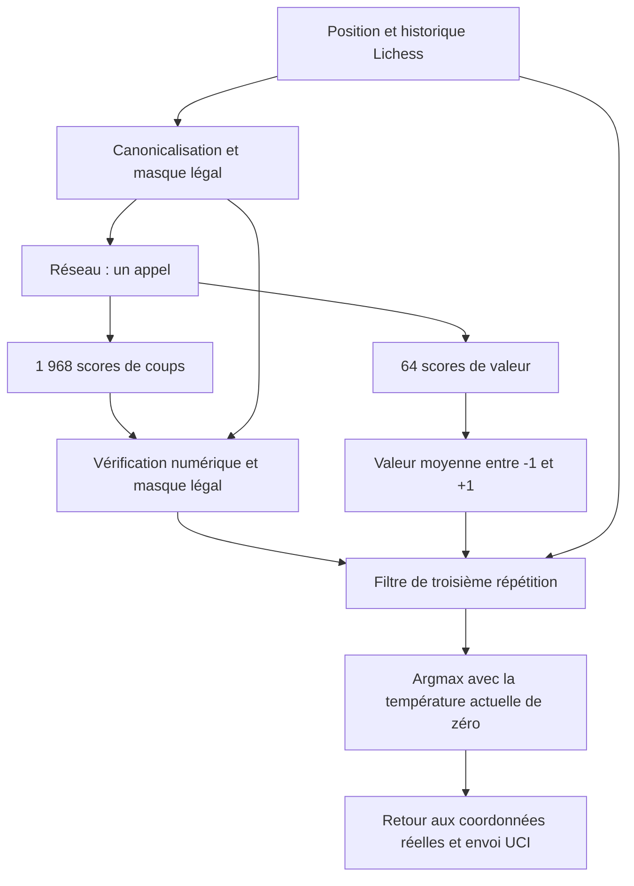

# CHESSFORMER-924K : fonctionnement, force et choix d’un coup

Ce document décrit la version publiée avec
[`chessformer-924k-v1.pt`](../models/chessformer-924k-v1.pt) : le modèle
`geometric` de **924 164 paramètres**, avec les réglages de jeu du
[`manifeste`](../models/manifest.json). Les futurs checkpoints pourront avoir
d’autres caractéristiques ; les explications ci-dessous concernent cette référence.

Le réseau examine la position une fois et produit deux sorties : un classement
des coups et une estimation de l’avantage. Python applique ensuite les règles
de légalité, consulte l’historique pour les répétitions et sélectionne un coup.

## 1. Ce que reçoit le réseau

Le bot reconstitue l’échiquier en rejouant les coups transmis par Lichess.
Le programme dispose ainsi de la position réelle et de son historique.

Avant l’appel au réseau, la position est placée du point de vue du joueur au
trait. Si les Noirs jouent, les rangées sont inversées et les couleurs échangées :
le réseau voit toujours le joueur à déplacer comme les Blancs. Par exemple,
un pion noir de `e7` devient un pion blanc de `e2`. Les colonnes sont conservées.
Le coup choisi sera transformé en sens inverse avant son envoi.

Cette transformation, appelée **canonicalisation**, permet de représenter de
la même façon deux positions équivalentes vues avec des couleurs opposées.
Les motifs appris peuvent ainsi servir aux deux camps.

L’entrée neuronale comprend :

| Information | Représentation |
|---|---|
| Pièces | 64 codes, un par case : vide ou l’un des 12 types de pièces colorées |
| Droits de roque | Un code parmi les 16 combinaisons des quatre droits |
| Prise en passant | Un code parmi neuf : aucune, ou l’une des huit colonnes |

Chaque case devient un vecteur de **96 nombres**. Le réseau additionne les
représentations apprises de sa pièce, de ses coordonnées, des droits de roque
et de la colonne de prise en passant.

L’historique et les compteurs de coups restent dans le programme Python : ils
ne sont pas fournis au réseau. Le même échiquier avec les mêmes droits de
roque et la même prise en passant produit donc les mêmes sorties neuronales,
même si l’historique est différent.

Sources : [encodage](../src/chessformer/encoding.py) et
[canonicalisation](../src/chessformer/canonical.py).

## 2. Comment 924 164 paramètres traitent l’échiquier

Le modèle publié contient **huit blocs**, chacun avec une attention à
**quatre têtes** et une transformation intermédiaire de largeur **256**.
Les 64 cases peuvent échanger de l’information : une pièce peut être
représentée en tenant compte des autres pièces et des cases éloignées.

L’attention inclut un biais appris dépendant du déplacement entre deux cases.
Les écarts de rangée et de colonne vont de −7 à +7, soit **15 × 15 = 225**
combinaisons par tête. Cette information géométrique donne au réseau des
repères pour représenter les alignements, les diagonales et les distances.
Les règles exactes des déplacements sont vérifiées séparément par Python.

Un appel traverse ces huit blocs **une seule fois** dans le checkpoint `v1`.
Les variantes expérimentales qui repassent plusieurs fois dans les mêmes
blocs ne décrivent pas le modèle publié ici.

La répartition exacte des paramètres est :

| Partie du modèle | Paramètres |
|---|---:|
| Représentations des pièces, cases, roques et prise en passant | 9 792 |
| Huit blocs géométriques | 893 472 |
| Normalisation finale | 96 |
| Tête de sélection des coups | 13 060 |
| Tête de valeur | 7 744 |
| **Total** | **924 164** |

La tête des coups contribue à cette compacité. Elle compare des représentations
des cases de départ et d’arrivée, puis ajoute une information spécifique aux
promotions. Ces représentations ont déjà intégré le contexte de l’échiquier.
Les mêmes projections servent à de nombreux coups.

À titre de comparaison de dimensions, une couche dense reliant directement
les `64 × 96` activations aux 1 968 sorties aurait plus de **12 millions de
coefficients**, hors biais. La tête utilisée ici en a **13 060**. Cette
factorisation laisse l’essentiel du budget aux blocs qui comprennent la position.

Source : [architecture du modèle](../src/chessformer/mini/model.py).

## 3. Pourquoi un modèle aussi petit peut être fort

**Le nombre de paramètres décrit sa taille, pas la quantité d’entraînement.**
Le checkpoint publié provient d’un run sur un corpus de **50 millions de
positions**, parcouru pendant deux époques, soit 100 millions de présentations
pour le run complet. Le meilleur checkpoint a été sélectionné à l’étape
**190 000**, après **97 279 616 exemples vus**.

Les positions portent des annotations Stockfish : meilleurs coups, variantes
MultiPV et évaluations. Le réseau apprend à reproduire ce classement et à
estimer la valeur de la position. Les coups annotés peuvent recevoir des poids
différents selon leur perte en centipions ; les coups non analysés n’ont pas
d’évaluation exhaustive fournie par ce corpus.

La configuration de ce run indique `teacher_weight=0` : la distillation depuis
un professeur CHESSFORMER-143M n’était pas activée pour ce checkpoint.

Avec de nombreux exemples, les poids peuvent apprendre des régularités utiles :
développement, sécurité du roi, pièces attaquées, échanges, motifs tactiques
et promotions. L’entraînement ajuste des règles statistiques partagées entre
les positions, plutôt que de stocker un dictionnaire de millions d’échiquiers.

Plusieurs choix emploient efficacement cette capacité : la canonicalisation
partage les motifs entre couleurs ; l’attention tient compte de tout
l’échiquier ; les biais géométriques représentent les relations entre cases ;
la tête factorisée partage ses paramètres entre coups. La tête de valeur
entraîne également la représentation à estimer l’avantage.

Enfin, `python-chess` fournit la légalité exacte au moment de jouer. Une
prédiction illégale peut être écartée, et le meilleur coup légal du réseau
reste disponible. Ce contrôle est une partie explicite du joueur complet.

Ces éléments expliquent comment une petite capacité peut être utile. La force
effective se vérifie en parties. La mesure retenue dans le suivi du projet le
**2 octobre 2026** est **1675 en blitz Lichess sur 68 parties**, sur le compte
[Chessformer-924K](https://lichess.org/@/Chessformer-924K).
Ce relevé concerne ce compte, cette opposition et cette date. Le classement
de chaque nouvel utilisateur se construit avec ses propres résultats.

**2000 Lichess blitz reste un objectif d’entraînement**, pas le niveau démontré
du checkpoint `v1`. Les évaluations locales contre des références Stockfish
mesurent une autre opposition et ne se convertissent pas directement en
classement Lichess.

## 4. Les deux sorties du réseau

### Les 1 968 scores de coups : la « policy »

Le vocabulaire contient **1 792 déplacements géométriques** de type dame ou
cavalier et **176 promotions explicites**, avec les quatre pièces possibles.
Les déplacements des autres pièces sont inclus dans ces géométries ; les
roques utilisent leurs coups UCI habituels.

Chaque sortie est un **logit**, un score brut servant à classer une action.
Un score de `6.2` ne signifie ni un avantage de 6,2 pions ni une probabilité
de victoire. Avec la température actuelle de zéro, seule leur comparaison
détermine le classement.

Le réseau produit les scores du vocabulaire complet, y compris des actions
illégales dans la position donnée. Le masque légal est calculé par Python
avant l’appel, puis appliqué aux scores après la sortie ; il n’entre pas dans
le réseau.

### Les 64 scores de valeur : l’estimation de l’avantage

La seconde tête produit des scores pour **64 valeurs réparties de −1 à +1**.
Python applique un `softmax`, puis calcule la moyenne pondérée :

```text
probabilités = softmax(scores_de_valeur)
valeur = somme(probabilité[i] × valeur_support[i])
```

La valeur est exprimée du point de vue du joueur au trait : un résultat
positif indique un avantage estimé pour lui, un résultat négatif un désavantage.
L’échelle vient des évaluations normalisées utilisées à l’entraînement.
Une valeur de `+0.6` n’est ni un score en pions ni un pourcentage de victoire.

Cette tête évalue **la position actuelle**. Dans le joueur publié, son rôle
pendant la décision est de déterminer si le filtre de répétition doit intervenir.

## 5. Après le réseau : les actions exactes de Python



### Étape 1 : vérifier les scores numériques

Les 1 968 logits de coups doivent être finis. Si un score vaut `NaN` ou une
infinité, le joueur lève une erreur et ne renvoie pas de coup de secours.
Cette vérification contrôle la sortie numérique ; elle ne juge pas sa qualité
échiquéenne.

### Étape 2 : retirer les coups illégaux

Le programme utilise le masque construit à partir de
[`board.legal_moves`](https://python-chess.readthedocs.io/en/v1.11.2/core.html#chess.Board.legal_moves).
Il respecte notamment le déplacement des pièces, les obstacles, la sécurité
du roi, les conditions du roque et la prise en passant.

Pour chaque action illégale, le score devient **`-inf`**. Ainsi, même un score
brut très élevé ne peut la faire choisir. Mettre le score à zéro ne suffirait
pas : les scores des coups légaux pourraient être négatifs.

Exemple fictif depuis la position initiale, avec les autres scores supposés
inférieurs à ceux montrés :

| Coup | Score brut inventé | Légal ? | Score après filtrage |
|---|---:|---|---:|
| `a1a8` | 9,7 | Non : la tour est bloquée | `-inf` |
| `e1e2` | 8,1 | Non : la case contient son propre pion | `-inf` |
| `g1f3` | 6,2 | Oui | 6,2 |
| `d2d4` | 5,9 | Oui | 5,9 |

Dans cet exemple, le meilleur score conservé est celui de `g1f3`. Les nombres
illustrent la méthode ; ils ne sont pas une mesure du checkpoint publié.

La légalité empêche les violations des règles. Un coup légal peut cependant
laisser une pièce en prise ou manquer un mat : la qualité du choix repose
sur le classement appris par le réseau.

### Étape 3 : consulter la valeur et éviter une troisième répétition

Le lanceur actuel passe `--avoid-repetition 0`. **Ce zéro est un seuil de
valeur : le filtre est activé.** Dans l’API du joueur, `repetition_value=None`
désactive ce traitement.

Si la valeur estimée est **strictement supérieure à zéro**, le programme
vérifie, pour chaque coup légal encore disponible, s’il ferait apparaître la
même position pour la troisième fois :

```python
board.push(coup)
repete_trois_fois = board.is_repetition(3)
board.pop()
```

Ces opérations travaillent sur l’échiquier réel et son historique.
[`is_repetition(3)`](https://python-chess.readthedocs.io/en/v1.11.2/core.html#chess.Board.is_repetition)
vérifie la répétition de la position obtenue. Les pièces, le joueur au trait
et les possibilités de jeu pertinentes, dont le roque et la prise en passant,
comptent dans cette comparaison. `pop()` restaure la position de départ.

Les positions obtenues servent à cette vérification d’historique. Le filtre
conserve l’évaluation unique de la position initiale : il ne rappelle pas
le réseau pour évaluer les coups ou les réponses adverses.

S’il existe au moins un autre coup légal, les coups causant une troisième
répétition reçoivent eux aussi **`-inf`**. Si tous les coups légaux répètent,
le programme conserve les scores pour pouvoir jouer. Si la valeur est
inférieure ou égale au seuil, le filtre laisse les scores intacts.

Par exemple, le réseau peut préférer un coup de tour qui répète, avec un
score de `7.8`, devant un autre coup légal à `7.1`. Si la valeur actuelle
vaut `+0.35`, le coup répétitif est écarté et l’autre peut être sélectionné.
Avec une valeur de `-0.20`, cette règle conserve la possibilité de répéter.

L’intention est de poursuivre le jeu quand le réseau estime avoir l’avantage,
plutôt que de répéter une position pouvant conduire à la nulle. Le filtre
ne garantit ni un gain réel ni une meilleure suite : cela dépend de la
justesse de la valeur et des scores appris.

Le compteur `repetitions_withheld` augmente lorsqu’un argmax avant ce filtre
était un coup répétitif effectivement écarté. Il compte ces décisions,
pas le nombre total de coups masqués.

### Étape 4 : choisir dans les scores restants

Avec **`temperature=0`**, le joueur prend l’**argmax** : l’indice du plus grand
score restant. Il n’a pas besoin de convertir les scores de coups en
probabilités. En cas d’égalité exacte, `argmax` retient le premier indice.
À position, historique, poids et environnement numérique identiques, le
choix est déterministe.

Une température positive permet un tirage selon
`softmax(scores_filtrés / température)`. Le réglage `sample_plies=20` limite
ce tirage aux vingt premiers demi-coups, soit dix coups par camp.
**Dans la configuration publiée, la température vaut zéro : ce tirage
n’intervient donc pas, même en ouverture.**

### Étape 5 : retrouver le coup réel et le transmettre

L’indice choisi est converti en objet `chess.Move`, en conservant la pièce
de promotion éventuelle. Si la position avait été canonicalisée pour les
Noirs, le mouvement est transformé en sens inverse.

L’adaptateur `MiniEngine` rend ce coup à la session Lichess. La session le
transmet au format UCI, par exemple `e2e4` ou `b7b8q`, à l’API des coups du
bot. Un verrou partagé sérialise les décisions lorsque plusieurs parties
sont ouvertes.

Sources : [choix du coup](../src/chessformer/mini/player.py),
[vocabulaire et masque](../src/chessformer/moves.py),
[adaptateur mini](../src/chessformer/mini/lichess.py) et
[session Lichess](../src/chessformer/lichess.py).

## 6. Où se situent les limites

Le réseau apprend à reconnaître des situations ressemblant à celles de son
entraînement. Une combinaison longue, une finale peu représentée ou une
position inhabituelle peut demander un choix qu’il classe mal. Les scores
ne sont pas accompagnés d’une démonstration tactique.

Le joueur choisit à partir d’un seul appel neuronal. Il ne déroule pas un
arbre de variantes, et ses décisions ne consultent ni Stockfish, ni un
modèle 143M, ni une bibliothèque d’ouvertures, ni une tablebase. Le jeu
temporaire des coups dans le filtre de répétition sert seulement à vérifier
la règle historique décrite plus haut.

Même lorsqu’il n’existe qu’un seul coup légal, le joueur appelle le réseau.
Avec zéro coup légal, il renvoie `None` avant cet appel. La session Lichess
vérifie également que la partie continue et que c’est au bot de jouer.

La valeur peut être trop optimiste et le filtrage légal laisse passer les
gaffes légales. L’absence d’historique et de compteur dans l’entrée neuronale
limite également ce que le modèle peut apprendre des répétitions et de la
règle des cinquante coups. L’amélioration du niveau exige donc de meilleures
décisions apprises et des validations en parties, au-delà du seul filtrage.
